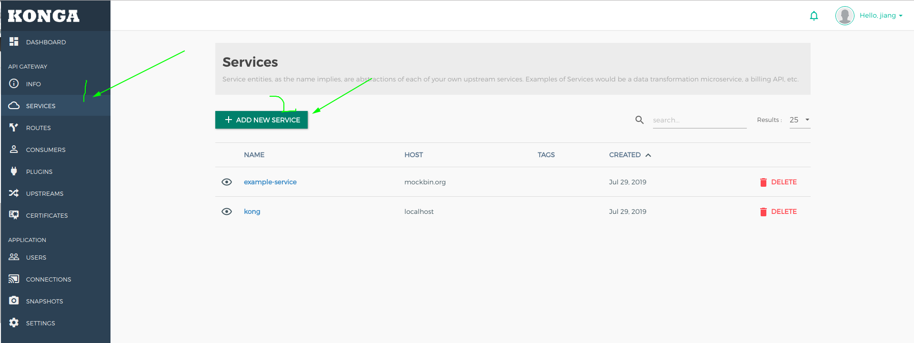
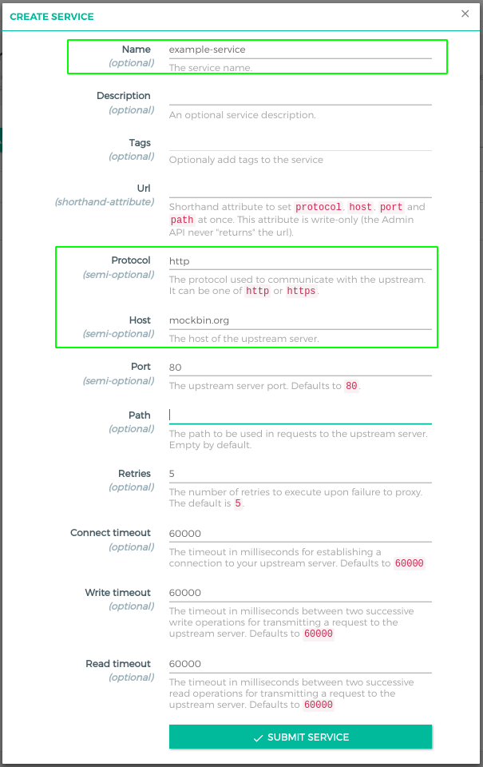
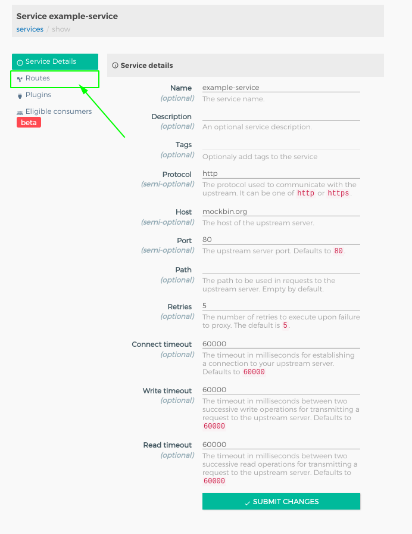
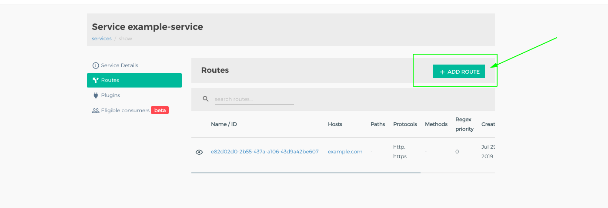
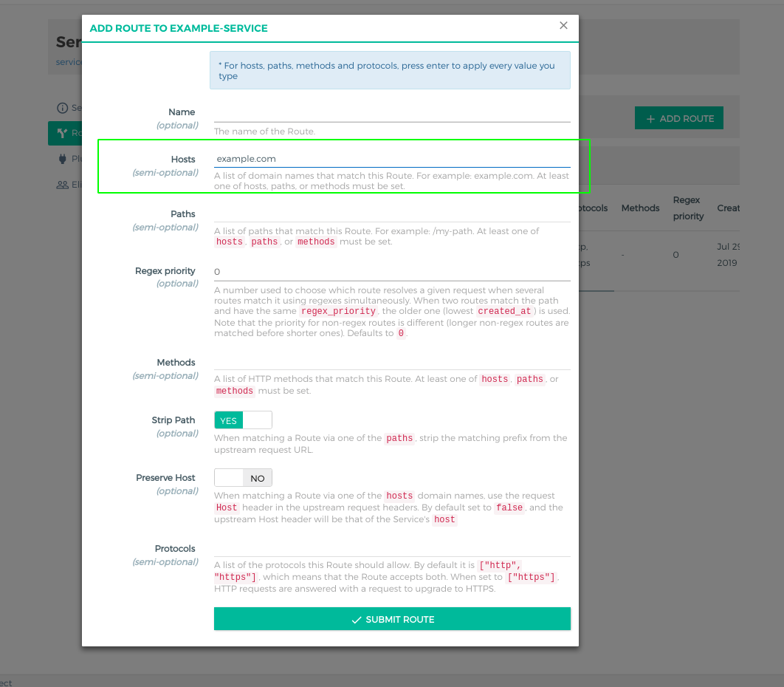

# kong-cluster

## 一、环境

1. docker
2. 熟悉docker-compose

## 二、安装

安装已提供了集成环境，可以使用 docker-compose 直接安装不再提供安装步骤

## 三、端口解释

默认情况下，Kong会侦听以下端口：

    8000 在其上侦听来自客户端的传入HTTP流量，并将其转发到您的上游服务。
    8443 Kong监听传入的HTTPS流量。此端口具有与端口类似的行为:8000，但它仅需要HTTPS流量。可以通过配置文件禁用此端口。
    8001 在其上的管理员API用于配置监听，公共配置接口的端口。
    8444 Admin API侦听HTTPS流量的位置。

## 四、快速使用

## 1、服务管理

    这是Kong用来指代它管理的上游API和微服务的名称。

### 1.1、通过接口添加服务

接口地址参考：<https://docs.konghq.com/1.2.x/admin-api/#service-object>

```
// 请求内容
curl -i -X POST \
--url http://localhost:8001/services/ \
--data 'name=example-service' \
--data 'url=http://mockbin.org'

// 响应内容
HTTP/1.1 201 Created
Content-Type: application/json
Connection: keep-alive

{
   "host":"mockbin.org",
   "created_at":1519130509,
   "connect_timeout":60000,
   "id":"92956672-f5ea-4e9a-b096-667bf55bc40c",
   "protocol":"http",
   "name":"example-service",
   "read_timeout":60000,
   "port":80,
   "path":null,
   "updated_at":1519130509,
   "retries":5,
   "write_timeout":60000
}
```

### 1.2、通过ｋｏｎｇａ－ｗｅｂ界面添加服务




## 2、路由管理

    在开始向服务发出请求之前，您需要为其添加路由。 路由指定请求在到达Kong后如何（以及是否）发送到其服务。 单个服务可以有多个路由。

### 2.1、通过接口添加路由

接口地址参考：<https://docs.konghq.com/1.2.x/admin-api/#route-object>

```
// 请求内容
curl -i -X POST \
--url http://localhost:8001/services/example-service/routes \
--data 'hosts[]=example.com'

// 响应内容
HTTP/1.1 201 Created
Content-Type: application/json
Connection: keep-alive

{
   "created_at":1519131139,
   "strip_path":true,
   "hosts":[
      "example.com"
   ],
   "preserve_host":false,
   "regex_priority":0,
   "updated_at":1519131139,
   "paths":null,
   "service":{
      "id":"79d7ee6e-9fc7-4b95-aa3b-61d2e17e7516"
   },
   "methods":null,
   "protocols":[
      "http",
      "https"
   ],
   "id":"f9ce2ed7-c06e-4e16-bd5d-3a82daef3f9d"
}
```

### 2.2、通过接口通过ｋｏｎｇａ－ｗｅｂ界面添加路由





### 2.3、通过Kong转发请求

```
curl -i -X GET \
--url http://localhost:8000/ \
--header 'Host: example.com'
```

kong 是通过解析 header 中 Host 来定位到服务然后进行转发

## 3、插件管理

Kong的核心原则之一是它通过插件的可扩展性。 插件允许您轻松地向服务添加新功能或使其更易于管理。

在下面的步骤中，您将配置key-auth插件以向您的服务添加身份验证。 在添加此插件之前，对您的服务的所有请求都将在上游代理。 添加和配置此插件后，只有具有正确密钥的请求才会被代理 - 所有其他请求将被Kong拒绝，从而保护您的上游服务免遭未经授权的使用。

插件的作用域有四种：

* 全局所有服务：plugins
* 指定服务关联的插件：/services/{service id}/plugins
* 指定路由关联的插件：/routes/{route id}/plugins
* 指定消费者关联的插件：/consumers/{consumer id}/plugins

配置多级插件的情况下的优先级参考官方文档：https://docs.konghq.com/1.2.x/admin-api/#precedence

### 3.1、针对服务配置插件

接口地址：<https://docs.konghq.com/1.2.x/admin-api/#plugin-object>

```
curl -i -X POST \
--url http://localhost:8001/services/example-service/plugins/ \
--data 'name=key-auth'
```

### 3.2、验证插件是否已正确配置

```
//发出以下cURL请求以验证是否在服务上正确配置了key-auth插件：
curl -i -X GET \
--url http://localhost:8000/ \
--header 'Host: example.com'

//由于您未指定所需的apikey标头或参数，因此响应应为
HTTP/1.1 401 Unauthorized
...

{
  "message": "No API key found in request"
}

```

## 4、消费者管理

### 4.1、添加消费者

接口地址：<https://docs.konghq.com/1.2.x/admin-api/#consumer-object>

```
curl -i -X POST \
--url http://localhost:8001/consumers/ \
--data "username=Jason"

// 返回结果
HTTP/1.1 201 Created
Content-Type: application/json
Connection: keep-alive

{
  "username": "Jason",
  "created_at": 1428555626000,
  "id": "bbdf1c48-19dc-4ab7-cae0-ff4f59d87dc9"
}
```

### 4.2、对消费者添加 key-auth 的秘钥凭据

```
curl -i -X POST \
--url http://localhost:8001/consumers/Jason/key-auth/ \
--data 'key=ENTER_KEY_HERE'
```

### 4.3、验证秘钥凭据是否正确

```
curl -i -X GET \
--url http://localhost:8000 \
--header "Host: example.com" \
--header "apikey: ENTER_KEY_HERE"
```

